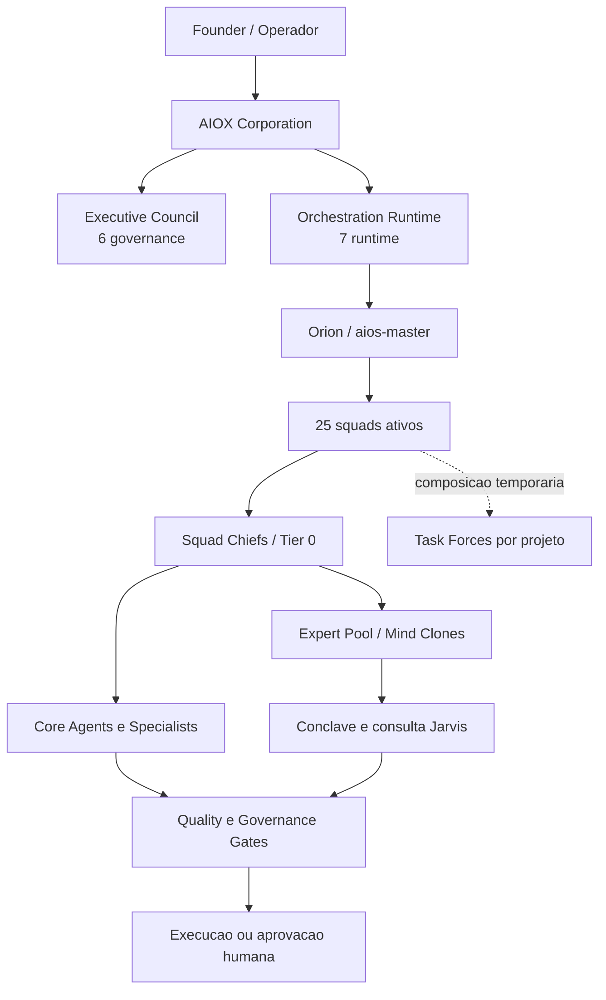

# AIOX Corporation DESIGN.md

**Status:** draft operacional  
**Autor:** Orion (`@aios-master`)  
**Gerado em:** 2026-07-11  
**Atualizado em:** 2026-07-26
**Story:** `docs/stories/active/squad-1-squad-first-architecture.md`  

## Fontes

Este documento consolida quatro fontes locais:

- `docs/projects/anipis/squad-16mai/05-design/AIOX-DESIGN.md`
- `.aios-core/routing-and-gates-policy.md`
- `squads/*/squad.yaml`
- `.aios-core/data/jarvis-mind-clone-index.json`

O `AIOX-DESIGN.md` fornece a linguagem visual. Os manifests `squads/*/squad.yaml` sao a fonte de verdade para hierarquia operacional. O indice Jarvis e tratado como catalogo consultivo de clones, nao como organograma.

## Identidade

AIOX Corporation e a camada corporativa do ecossistema AIOS: uma organizacao de agentes, squads e clones mentais operando em modelo `squad-first`.

A marca visual segue a edicao **Dark Cockpit**: brutalist minimalist, premium institucional, fria, tecnica e implacavel. O sistema nao vende hype. Ele mostra controle, direcao e capacidade operacional.

### Mnemotecnico AIOX

- **A:** Arrow, a IA como seta direcional
- **I:** Input, historias e intencoes virando comandos
- **O:** Orchestration, squads e agentes sincronizados
- **X:** X-marks-the-spot, destino, decisao e ponto de execucao

### Arquetipos

- **Magician:** 60%
- **Sage:** 25%
- **Explorer:** 15%

### Tom

- Revelador, nao promocional
- Preciso, nao professoral
- Institucional, nao corporativo vazio
- Frio quando decide, claro quando explica
- Direto sobre limites, riscos e gates

### Frase Canonica

> Eu nao preciso ser programador para criar. A IA e a seta. O X e meu.

## Principios De Design

1. **Cockpit antes de vitrine:** a primeira impressao deve parecer um centro de comando, nao uma landing page generica.
2. **Operacao antes de promessa:** cada bloco visual precisa mostrar uma capacidade, uma decisao, um estado ou uma rota.
3. **Hierarquia acima de decoracao:** layout, cor e tipografia servem para revelar comando, squad, agente, clone, gate e status.
4. **Um acento, muita disciplina:** Kinetic Limon e o unico acento forte. O resto e superficie, texto, borda e estado.
5. **Squad-first:** interfaces, documentos e comandos devem apresentar squads antes de agentes individuais.
6. **Gates visiveis:** qualquer acao irreversivel, externa ou sensivel deve deixar claro qual gate governa a decisao.

## Tokens Visuais

### Cores

| Token | Valor | Uso |
|---|---:|---|
| `primary` | `#D1FF00` | Kinetic Limon, acento assinatura |
| `primary-deep` | `#9FCC00` | Hover, pressed, estados ativos |
| `primary-soft` | `#F0FFB0` | Badges e fundos sutis |
| `void` | `#0A0A0B` | Canvas principal |
| `surface` | `#141416` | Paineis elevados |
| `surface-2` | `#1C1C1F` | Cards e callouts |
| `surface-3` | `#252528` | Elevacao secundaria |
| `border` | `#2A2A2E` | Divisores finos |
| `border-strong` | `#3D3D42` | Separacao estrutural |
| `text-primary` | `#F4F1EA` | Texto principal |
| `text-secondary` | `#A8A4A0` | Texto secundario |
| `text-tertiary` | `#6B6864` | Captions e estados fracos |
| `success` | `#7BC97B` | Sucesso |
| `warning` | `#E8B23A` | Atencao |
| `error` | `#E0533D` | Erro, bloqueio |
| `info` | `#5C8FE8` | Informacao |

### Tipografia

| Papel | Fonte | Peso | Uso |
|---|---|---:|---|
| Display | TASA Orbiter | 800 | Capa, manifesto, headers de sistema |
| H1-H4 | Geist | 600-700 | Titulos de produto e operacao |
| Body | Geist | 400 | Conteudo editorial e specs |
| Label | Geist | 600 | Controles, badges, labels uppercase |
| Code | Roboto Mono | 500 | Comandos, IDs, logs, manifests |

### Forma

- Radius padrao: `4px` a `6px`
- Cards: apenas para itens repetidos, modais e ferramentas enquadradas
- Bordas: hairline, frias, sempre funcionais
- Glow: permitido apenas para foco/acento critico, nunca como decoracao solta

## Componentes Canonicos

| Componente | Regra |
|---|---|
| `button-primary` | Fundo `primary`, texto `text-on-accent`, uppercase, raio pequeno |
| `button-ghost` | Transparente, borda forte, texto primario |
| `card-surface` | Painel de informacao operacional |
| `card-elevated` | Item repetido ou ferramenta enquadrada |
| `callout-accent` | Destaque de decisao ou rota ativa |
| `callout-warning` | Risco, gate pendente, incerteza |
| `callout-error` | Bloqueio ou violacao de policy |
| `table-header` | Header compacto para inventarios |
| `pill-tag` | Tipo, status, squad, nivel |
| `divider` | Separacao estrutural, nao decorativa |

## Modelo Operacional

AIOX opera por hierarquia de decisao, nao por lista de agentes. O fluxo padrao e:

```text
Founder
  -> AIOX Corporation
    -> Executive / Governance
      -> Orion (@aios-master)
        -> Squad Chief
          -> Core Agent / Specialist
            -> Mind Clone / Expert Pool
              -> Quality Gate / Human Approval
```



### Regras De Roteamento

1. A intencao vira dominio.
2. O dominio aponta para um squad.
3. O chief do squad recebe a tarefa como entrada Tier 0.
4. O chief distribui para agentes core, especialistas ou clones.
5. O Expert Pool entra quando ha incerteza, risco ou decisao significativa.
6. Gates bloqueiam ou exigem revisao quando ha gatilho material.

### Gates Principais

| Gate | Dono | Quando dispara |
|---|---|---|
| Story-driven | `@sm` / `@pm` | Inicio de trabalho estruturado |
| No-invention | Qualquer agente | Ao citar fato, spec, dado ou claim |
| Quality | `@qa` / operations | Merge, release, push ou entrega tecnica |
| Security | `@bruce-schneier` | Segredo, dependencia, superficie de ataque |
| Legal | `@heather-meeker` | Contrato, termos, compliance |
| Privacy/LGPD | `@ann-cavoukian` | Dados pessoais ou sensiveis |
| Finance | `@aswath-damodaran` | Custo, receita, pricing, unit economics |
| Brand | `@ann-handley` | Comunicacao externa e identidade |
| Human approval | Founder | Deploy prod, push, gasto, envio externo |

## Inventario Hierarquico

Resumo derivado dos manifests atuais:

- **Squads com manifest:** 25
- **Membros operacionais somados:** 272
- **Core agents:** 24
- **Mind clones em squads:** 207
- **Especialistas/outros:** 41
- **Catalogo Jarvis de clones:** 253 entradas

Observacao: a soma por squad inclui duplicacoes intencionais. Alguns clones pertencem a mais de um contexto, por exemplo seguranca + legal, dados + mercados, saude + comportamento.

### Snapshot Auditavel Do Catalogo

Snapshot derivado em 2026-07-26 das fontes locais, excluindo manifests sob `squads/.deprecated/`:

| Medida | Total | Interpretacao |
|---|---:|---|
| Manifests ativos | 25 | Squads que participam da arquitetura vigente |
| Participacoes em squads | 272 | Soma das listas `agents`; inclui repeticoes cross-squad |
| IDs unicos nas listas de membros | 246 | Pessoas/agentes sem dupla contagem |
| Participacoes `mind_clone` | 207 | Ocupacoes de assento por clones nos squads |
| IDs unicos `mind_clone` | 181 | Clones distintos classificados explicitamente nos manifests |
| Entradas no indice Jarvis | 253 | Identidades unicas catalogadas |
| Entradas Jarvis referenciadas por squad/head | 250 | Entradas com pelo menos um vinculo operacional ativo |
| Entradas Jarvis sem squad ativo | 3 | Catalogadas, mas sem alocacao em manifest vigente |

Distribuicao das 253 entradas por origem:

| Origem | Total |
|---|---:|
| `codex-agent` | 127 |
| `aios-agent` | 61 |
| `mega-brain` | 55 |
| `squad-agent` | 10 |

#### Divergencia De Schema

O arquivo `.aios-core/data/jarvis-mind-clone-index.json` vigente possui `id`, `name`, `department`, `source`, `role`, `keywords`, `frameworks`, `commands` e `filePath`. Ele **nao possui**, neste snapshot, os campos `membership`, `domain` e `squads` citados em documentos anteriores.

Por isso:

1. Vinculo operacional e tipo sao derivados apenas dos 25 manifests ativos.
2. `department` e `source` continuam sendo lidos diretamente do indice Jarvis.
3. Nenhuma classificacao ausente e inferida ou inventada.
4. Os tres IDs catalogados sem squad ativo sao: `@anderson-hernandes`, `@heleno-taveira-torres` e `@roberto-dias-duarte`.

### Executive Team

**Head:** `@ceo`  
**Total:** 6  
**Camada:** governance

- Outros: `@ceo`, `@cfo`, `@coo`, `@cmo`, `@cro`, `@cco`

### Expert Council

**Head:** `@conclave-coordinator`  
**Total:** 2  
**Camada:** governance

- Outros: `@conclave-coordinator`, `@template-mind-clone`

### Squad Executive

**Head:** `@aios-master`  
**Total:** 12  
**Core:** 5  
**Mind clones:** 6

- Core: `@aios-master`, `@architect`, `@pm`, `@aios-orchestrator`, `@sop-extractor`
- Mind clones: `@aswath-damodaran`, `@seth-godin`, `@patty-mccord`, `@alex-hormozi`, `@bruce-schneier`, `@demis-hassabis`
- Outros: `@oalanicolas`

### Squad Engineering

**Head:** `@architect`  
**Total:** 16  
**Core:** 2  
**Mind clones:** 14

- Core: `@dev`, `@aios-developer`
- Mind clones: `@will-larson`, `@werner-vogels`, `@martin-fowler`, `@kent-beck`, `@uncle-bob-martin`, `@linus-torvalds`, `@addy-osmani`, `@dan-abramov`, `@guillermo-rauch`, `@kent-c-dodds`, `@matt-pocock`, `@pablo-hoffman`, `@ryan-dahl`, `@sam-newman`

### Squad Platform

**Head:** `@kelsey-hightower`  
**Total:** 9  
**Core:** 1  
**Mind clones:** 8

- Core: `@github-devops`
- Mind clones: `@kelsey-hightower`, `@gene-kim`, `@charity-majors`, `@brendan-gregg`, `@niall-murphy`, `@casey-rosenthal`, `@mitchell-hashimoto`, `@paul-copplestone`

### Squad Data

**Head:** `@data-engineer`  
**Total:** 10  
**Core:** 2  
**Mind clones:** 8

- Core: `@data-engineer`, `@db-sage`
- Mind clones: `@chip-huyen`, `@martin-kleppmann`, `@markus-winand`, `@joe-reis`, `@craig-kerstiens`, `@nate-silver`, `@philip-tetlock`, `@robin-hanson`

### Squad AI

**Head:** `@demis-hassabis`  
**Total:** 16  
**Mind clones:** 16

- Mind clones: `@fei-fei-li`, `@andrew-ng`, `@andrej-karpathy`, `@chip-huyen`, `@cassie-kozyrkov`, `@ilya-sutskever`, `@yann-lecun`, `@harrison-chase`, `@jerry-liu`, `@alan-nichol`, `@timnit-gebru`, `@swyx`, `@lilian-weng`, `@jim-fan`, `@demis-hassabis-dossier`, `@demis-hassabis`

### Squad Product

**Head:** `@pm`  
**Total:** 5  
**Core:** 1  
**Mind clones:** 4

- Core: `@po`
- Mind clones: `@april-dunford`, `@don-norman`, `@teresa-torres`, `@marty-cagan`

### Squad Design

**Head:** `@design-lead`  
**Total:** 23  
**Core:** 8  
**Mind clones:** 15

- Core: `@design-lead`, `@ux-design-expert`, `@ui-designer`, `@design-systems-engineer`, `@motion-designer`, `@ux-designer`, `@ux-researcher`, `@ux-writer`
- Mind clones: `@marty-neumeier`, `@don-norman`, `@john-maeda`, `@dieter-rams`, `@brad-frost`, `@erik-spiekermann`, `@tobias-van-schneider`, `@edward-tufte`, `@kat-holmes`, `@val-head`, `@vitaly-friedman`, `@julie-zhuo`, `@cathy-pearl`, `@refika-anadol`, `@abby-covert`

### Squad Behavioral Design

**Head:** `@bj-fogg`  
**Total:** 7  
**Mind clones:** 7

- Mind clones: `@bj-fogg`, `@nir-eyal`, `@yu-kai-chou`, `@richard-thaler`, `@daniel-kahneman`, `@acacia-parks`, `@rafael-calvo`

### Squad Security

**Head:** `@bruce-schneier`  
**Total:** 16  
**Mind clones:** 16

- Mind clones: `@bruce-schneier`, `@daniel-miessler`, `@peter-kim`, `@georgia-weidman`, `@kevin-mitnick`, `@hd-moore`, `@chris-sanders`, `@mikko-hypponen`, `@wendi-whitmore`, `@jim-manico`, `@troy-hunt`, `@tanya-janca`, `@omar-santos`, `@ann-cavoukian`, `@john-kindervag`, `@marcus-carey`

### Squad Legal

**Head:** `@heather-meeker`  
**Total:** 13  
**Mind clones:** 13

- Mind clones: `@richard-susskind`, `@lawrence-lessig`, `@patricia-peck`, `@heather-meeker`, `@ann-cavoukian`, `@john-kindervag`, `@adriana-dallari`, `@lucia-savage`, `@bakul-patel`, `@erik-nymanczuk`, `@joel-de-menezes-niebuhr`, `@marcal-justen-filho`, `@liran-tal`

### Squad Operations

**Head:** `@sm`  
**Total:** 8  
**Core:** 4  
**Mind clones:** 4

- Core: `@qa`, `@devops`, `@squad-creator`, `@pedro-valerio`
- Mind clones: `@eliyahu-goldratt`, `@eric-ries`, `@nicole-forsgren`, `@jez-humble`

### Squad Research

**Head:** `@analyst`  
**Total:** 10  
**Mind clones:** 6  
**Outros:** 4

- Mind clones: `@peter-diamandis`, `@clayton-christensen`, `@scott-galloway`, `@alexander-osterwalder`, `@dave-snowden`, `@steve-blank`
- Outros: `@trend-hunter`, `@market-analyst`, `@competitor-watcher`, `@niche-explorer`

### Squad Finance

**Head:** `@aswath-damodaran`  
**Total:** 10  
**Mind clones:** 10

- Mind clones: `@morgan-housel`, `@mariana-mazzucato`, `@ray-dalio`, `@warren-buffett`, `@rob-walling`, `@brad-feld`, `@danijel-overtime`, `@domer-polymarket`, `@gcr-crypto`, `@theo-polymarket`

### Squad Markets Intelligence

**Head:** `@luana-lopes-lara`  
**Total:** 9  
**Mind clones:** 9

- Mind clones: `@luana-lopes-lara`, `@domer-polymarket`, `@theo-polymarket`, `@gcr-crypto`, `@danijel-overtime`, `@robin-hanson`, `@nate-silver`, `@philip-tetlock`, `@scott-alexander`

### Squad Sales

**Head:** `@alex-hormozi`  
**Total:** 16  
**Mind clones:** 8  
**Outros:** 8

- Mind clones: `@chris-voss`, `@jeb-blount`, `@matt-dixon`, `@guillaume-moubeche`, `@patrick-campbell`, `@grant-cardone`, `@russell-brunson`, `@jay-abraham`
- Outros: `@sales-strategist`, `@lead-qualifier`, `@sales-closer`, `@proposal-writer`, `@sales-ops-analyst`, `@pricing-strategist`, `@crm-manager`, `@outbound-specialist`

### Marketing Traffic

**Head:** `@traffic-masters-chief`  
**Total:** 28  
**Chief:** 1  
**Mind clones:** 15  
**Specialists:** 12

- Chief: `@traffic-masters-chief`
- Mind clones: `@molly-pittman`, `@andre-chaperon`, `@kasim-aslam`, `@depesh-mandalia`, `@nicholas-kusmich`, `@ralph-burns`, `@tom-breeze`, `@peep-laja`, `@pedro-sobral`, `@neil-patel`, `@gary-vaynerchuk`, `@larry-kim`, `@oli-gardner`, `@rand-fishkin`, `@wes-bush`
- Specialists: `@analytics-agent`, `@audience-researcher`, `@campaign-manager`, `@copy-specialist`, `@email-marketing-specialist`, `@funnel-architect`, `@growth-strategist`, `@influencer-partnership-manager`, `@landing-page-optimizer`, `@retention-specialist`, `@seo-content-strategist`, `@social-media-manager`

### Squad Content

**Head:** `@ann-handley`  
**Total:** 8  
**Core:** 1  
**Mind clones:** 7

- Core: `@slide-creator`
- Mind clones: `@ann-handley`, `@robert-mckee`, `@joe-pulizzi`, `@donald-miller`, `@charles-spurgeon`, `@joanna-wiebe`, `@ryan-holiday`

### Squad Customer Success

**Head:** `@lincoln-murphy`  
**Total:** 10  
**Mind clones:** 3  
**Outros:** 7

- Mind clones: `@lincoln-murphy`, `@nick-mehta`, `@jason-lemkin`
- Outros: `@onboarding-specialist`, `@customer-support-t1`, `@customer-support-t2`, `@customer-success-manager`, `@churn-prevention`, `@voice-of-customer`, `@community-manager`

### Squad Health

**Head:** `@alison-darcy`  
**Total:** 18  
**Mind clones:** 18

- Mind clones: `@kate-ryder`, `@bakul-patel`, `@atul-butte`, `@sean-duffy`, `@dena-bravata`, `@lucia-savage`, `@micky-tripathi`, `@stephen-hahn`, `@halle-tecco`, `@johannes-thrul`, `@eduardo-bunge`, `@david-ebersman`, `@geoff-cook`, `@acacia-parks`, `@christian-dunker`, `@eric-topol`, `@rafael-calvo`, `@bj-fogg`

### Squad People

**Head:** `@patty-mccord`  
**Total:** 7  
**Mind clones:** 7

- Mind clones: `@adam-grant`, `@laszlo-bock`, `@josh-bersin`, `@simon-sinek`, `@brene-brown`, `@darren-murph`, `@amy-edmondson`

### Squad Education

**Head:** `@sal-khan`  
**Total:** 2  
**Mind clones:** 2

- Mind clones: `@anders-ericsson`, `@sugata-mitra`

### Squad Community

**Head:** `@sarah-drasner`  
**Total:** 3  
**Mind clones:** 3

- Mind clones: `@sarah-drasner`, `@simon-willison`, `@scott-hanselman`

### Innovation

**Head:** `@clayton-christensen`  
**Total:** 8  
**Mind clones:** 8

- Mind clones: `@clayton-christensen`, `@eric-ries`, `@steve-blank`, `@alexander-osterwalder`, `@peter-diamandis`, `@mariana-mazzucato`, `@marty-cagan`, `@teresa-torres`

## Catalogo Jarvis Integral

Este e o indice alfabetico completo das **253 identidades unicas** presentes em `.aios-core/data/jarvis-mind-clone-index.json` no snapshot de 2026-07-26. O catalogo inclui mind clones, agentes funcionais, runtime e governance; portanto, "entrada Jarvis" e mais preciso do que chamar todas as entradas de mind clones.

As alocacoes operacionais aparecem no inventario por squad acima. Os tres IDs sem alocacao ativa estao explicitados na secao `Divergencia De Schema`.

### A (27)

@abby-covert · @acacia-parks · @adam-grant · @addy-osmani · @adriana-dallari · @aios-developer · @aios-master · @aios-orchestrator · @alan-nichol · @alex-hormozi · @alexander-osterwalder · @alison-darcy · @amy-edmondson · @analyst · @analytics-agent · @anders-ericsson · @anderson-hernandes · @andre-chaperon · @andrej-karpathy · @andrew-ng · @ann-cavoukian · @ann-handley · @april-dunford · @architect · @aswath-damodaran · @atul-butte · @audience-researcher

### B (7)

@bakul-patel · @bj-fogg · @brad-feld · @brad-frost · @brendan-gregg · @brene-brown · @bruce-schneier

### C (27)

@campaign-manager · @casey-rosenthal · @cassie-kozyrkov · @cathy-pearl · @cco · @ceo · @cfo · @charity-majors · @charles-spurgeon · @chip-huyen · @chris-sanders · @chris-voss · @christian-dunker · @churn-prevention · @clayton-christensen · @cmo · @community-manager · @competitor-watcher · @conclave-coordinator · @coo · @copy-specialist · @craig-kerstiens · @crm-manager · @cro · @customer-success-manager · @customer-support-t1 · @customer-support-t2

### D (21)

@dan-abramov · @daniel-kahneman · @daniel-miessler · @danijel-overtime · @darren-murph · @data-engineer · @dave-snowden · @david-ebersman · @db-sage · @demis-hassabis · @demis-hassabis-dossier · @dena-bravata · @depesh-mandalia · @design-lead · @design-systems-engineer · @dev · @devops · @dieter-rams · @domer-polymarket · @don-norman · @donald-miller

### E (8)

@eduardo-bunge · @edward-tufte · @eliyahu-goldratt · @email-marketing-specialist · @eric-ries · @eric-topol · @erik-nymanczuk · @erik-spiekermann

### F (2)

@fei-fei-li · @funnel-architect

### G (10)

@gary-vaynerchuk · @gcr-crypto · @gene-kim · @geoff-cook · @georgia-weidman · @github-devops · @grant-cardone · @growth-strategist · @guillaume-moubeche · @guillermo-rauch

### H (5)

@halle-tecco · @harrison-chase · @hd-moore · @heather-meeker · @heleno-taveira-torres

### I (2)

@ilya-sutskever · @influencer-partnership-manager

### J (16)

@jason-lemkin · @jay-abraham · @jeb-blount · @jerry-liu · @jez-humble · @jim-fan · @jim-manico · @joanna-wiebe · @joe-pulizzi · @joe-reis · @joel-de-menezes-niebuhr · @johannes-thrul · @john-kindervag · @john-maeda · @josh-bersin · @julie-zhuo

### K (7)

@kasim-aslam · @kat-holmes · @kate-ryder · @kelsey-hightower · @kent-beck · @kent-c-dodds · @kevin-mitnick

### L (11)

@landing-page-optimizer · @larry-kim · @laszlo-bock · @lawrence-lessig · @lead-qualifier · @lilian-weng · @lincoln-murphy · @linus-torvalds · @liran-tal · @luana-lopes-lara · @lucia-savage

### M (17)

@marcal-justen-filho · @marcus-carey · @mariana-mazzucato · @market-analyst · @markus-winand · @martin-fowler · @martin-kleppmann · @marty-cagan · @marty-neumeier · @matt-dixon · @matt-pocock · @micky-tripathi · @mikko-hypponen · @mitchell-hashimoto · @molly-pittman · @morgan-housel · @motion-designer

### N (8)

@nate-silver · @neil-patel · @niall-murphy · @niche-explorer · @nicholas-kusmich · @nick-mehta · @nicole-forsgren · @nir-eyal

### O (5)

@oalanicolas · @oli-gardner · @omar-santos · @onboarding-specialist · @outbound-specialist

### P (15)

@pablo-hoffman · @patricia-peck · @patrick-campbell · @patty-mccord · @paul-copplestone · @pedro-sobral · @pedro-valerio · @peep-laja · @peter-diamandis · @peter-kim · @philip-tetlock · @pm · @po · @pricing-strategist · @proposal-writer

### Q (1)

@qa

### R (15)

@rafael-calvo · @ralph-burns · @rand-fishkin · @ray-dalio · @refika-anadol · @retention-specialist · @richard-susskind · @richard-thaler · @rob-walling · @robert-mckee · @roberto-dias-duarte · @robin-hanson · @russell-brunson · @ryan-dahl · @ryan-holiday

### S (23)

@sal-khan · @sales-closer · @sales-ops-analyst · @sales-strategist · @sam-newman · @sarah-drasner · @scott-alexander · @scott-galloway · @scott-hanselman · @sean-duffy · @seo-content-strategist · @seth-godin · @simon-sinek · @simon-willison · @slide-creator · @sm · @social-media-manager · @sop-extractor · @squad-creator · @stephen-hahn · @steve-blank · @sugata-mitra · @swyx

### T (10)

@tanya-janca · @template-mind-clone · @teresa-torres · @theo-polymarket · @timnit-gebru · @tobias-van-schneider · @tom-breeze · @traffic-masters-chief · @trend-hunter · @troy-hunt

### U (6)

@ui-designer · @uncle-bob-martin · @ux-design-expert · @ux-designer · @ux-researcher · @ux-writer

### V (3)

@val-head · @vitaly-friedman · @voice-of-customer

### W (5)

@warren-buffett · @wendi-whitmore · @werner-vogels · @wes-bush · @will-larson

### Y (2)

@yann-lecun · @yu-kai-chou

## Padrao De Interface Para Hierarquia

Ao exibir a AIOX Corporation em UI, documento ou CLI:

1. Mostre primeiro o squad e o head.
2. Mostre contagens antes de nomes.
3. Separe `core`, `mind_clone`, `specialist` e `governance`.
4. Mostre gates ao lado de acoes, nao em rodape.
5. Mostre clones como capacidade ativa do squad quando estao em `squad.yaml`.
6. Mostre o Jarvis index como pool consultivo, nao como cadeia de comando.

## Padrao CLI First

Toda capacidade AIOX deve existir em CLI antes de painel visual:

```text
CLI First -> Observability Second -> UI Third
```

Comandos esperados para essa arquitetura:

- `*squads`: lista squads e status
- `*squad {name}`: mostra manifest, head, membros e gates
- `*dispatch {intent}`: resolve dominio, squad, head e proximo passo
- `*status`: mostra story, branch, contexto e pendencias

## Anti-Patterns

- Listar 200+ clones sem squad, nivel ou funcao.
- Tratar mind clone apenas como consultor quando ele esta ativo em `squad.yaml`.
- Colocar UI acima de CLI.
- Esconder gates em documentacao secundaria.
- Usar gradientes, orbes ou decoracao sem funcao operacional.
- Misturar brand externa com cockpit interno sem separar estados e audiencia.
- Criar agente pessoa novo sem DNA, fonte ou governanca.

## Definition Of Done Para Artefatos AIOX

Um artefato visual, documental ou operacional da AIOX esta completo quando:

- Usa os tokens Dark Cockpit.
- Apresenta squads antes de individuos.
- Distingue core agents, specialists, mind clones e governance.
- Explica qual gate governa a acao.
- Mantem rastreabilidade para story, manifest ou policy.
- Nao inventa clone, cargo, fonte ou estado.
- Pode ser operado via CLI sem depender de UI.
