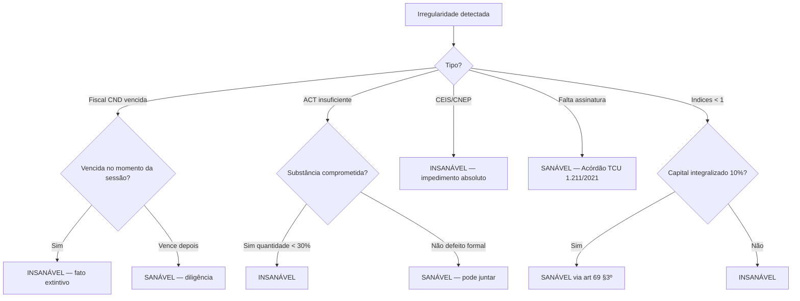
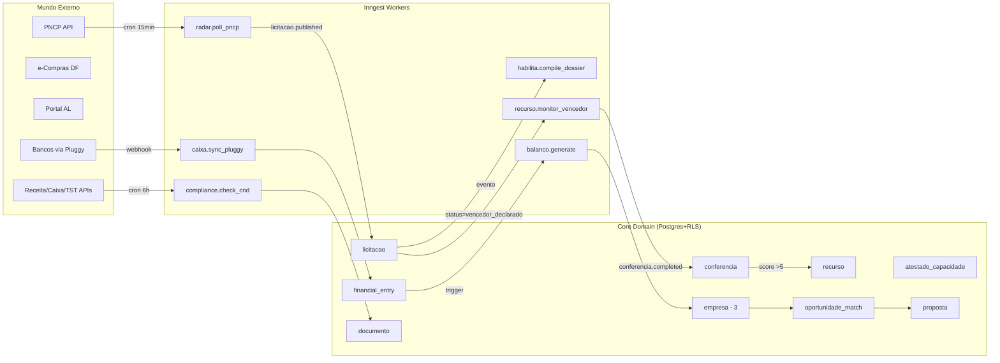
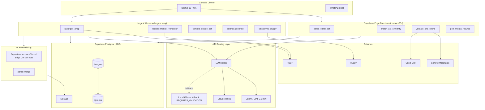

# Architecture Mega Research — PDF Parsing, ACT Matcher, Auto-BP/DRE, Dossiê, Minuta de Recurso

**Agente:** @architect (Aria) — voz canalizada de Martin Fowler · Werner Vogels · Chip Huyen · Marçal Justen Filho
**Data:** 2026-05-18
**Escopo:** Estágios 4 (HABILITAR) e 6 (RECORRER) do workflow do **buscador-licitacoes** + arquitetura geral de integração entre os 6 estágios
**Correção do briefing:** São **3 empresas** (1 faz licitação + 2 de gestão financeira), não 4 — afeta RLS, anti-conluio e modelagem `empresa.atua_em_licitacao bool`. Anti-conluio continua sendo gate arquitetural; só muda o universo de empresas elegíveis.

**Princípio canalizado de Fowler:** *“Make the change easy (warning: this may be hard), then make the easy change.”* Schema-day-1 do briefing já segue isso. Este doc operacionaliza os 6 fluxos críticos sem virar monolito.

**Princípio canalizado de Vogels:** *“Everything fails, all the time.”* O sistema processa PDFs de orgãos públicos brasileiros — falha de PDF parsing, alucinação de LLM e indisponibilidade de PNCP são **probabilidades, não cenários extremos**. Degradação elegante é design constraint, não bonus.

**Princípio canalizado de Chip Huyen:** *“Without an offline eval set, ML systems silently degrade.”* ACT matcher e classificador sanável-vs-insanável precisam de eval offline desde o Sprint 4.

**Princípio canalizado de Justen Filho:** *“Formalismo moderado significa: a substância prevalece sobre a forma, mas a forma escrita continua sendo prova.”* Minuta de recurso pode ser gerada por sistema; **citação legal e jurisprudência devem ser referenciadas, não inventadas**.

---

## 1. PDF PARSING DE EDITAL — Comparativo Profundo

### 1.1 Matriz comparativa (editais brasileiros 50-200p com tabelas)

| Ferramenta | Tipo | Precisão PT-BR jurídico | Extração tabelas | Custo 100p | Latência 100p | Self-host | Licença |
|------------|------|--------------------------|------------------|------------|---------------|-----------|---------|
| **LlamaParse** | Cloud (LlamaIndex) | ★★★★☆ — bom em PT, tabelas via LLM | ★★★★☆ | ~US$0,30 (Premium) / 1k pgs/dia free tier | 30-90s | ❌ | Proprietária |
| **Unstructured.io** | OSS / Cloud híbrido | ★★★☆☆ — PT-BR razoável, depende do modelo | ★★★☆☆ | OSS R$0 / cloud ~US$0,01/pg | 5-30s | ✅ Docker | Apache 2.0 |
| **Adobe PDF Extract** | Cloud (Adobe) | ★★★★★ — top em tabela complexa | ★★★★★ | US$0,05/doc | 10-40s | ❌ | Proprietária |
| **pdfplumber** | Python puro | ★★★☆☆ — texto OK, sem OCR | ★★★☆☆ regras manuais | R$0 | <2s | ✅ | MIT |
| **Marker (Datalab)** | OSS modelo local | ★★★★☆ — bom em PT, layout-aware | ★★★★☆ | R$0 (compute próprio) | 5-15s GPU / 30-90s CPU | ✅ | GPL-3 (REQUIRES_VALIDATION p/ uso comercial) |
| **Mistral OCR** | Cloud (Mistral) | ★★★★☆ — novo (out/2024) | ★★★★☆ | ~US$1/1000pg | 5-20s | ❌ | Proprietária |
| **Docling (IBM)** | OSS | ★★★★☆ — RAG-friendly, markdown nativo | ★★★★★ tabelas TF | R$0 | 8-30s CPU | ✅ MIT | MIT |
| **GROBID** | OSS científico | ★★☆☆☆ — orientado a papers, ruim p/ edital | ★★☆☆☆ | R$0 | 3-10s | ✅ | Apache 2.0 |

Fontes: [LlamaParse pricing](https://docs.cloud.llamaindex.ai/llamaparse/usage_data), [Adobe PDF Services Extract API](https://developer.adobe.com/document-services/docs/overview/pdf-extract-api/), [Docling IBM Research](https://github.com/DS4SD/docling), [Marker Datalab](https://github.com/VikParuchuri/marker), [Mistral OCR launch](https://mistral.ai/news/mistral-ocr), [pdfplumber](https://github.com/jsvine/pdfplumber), [Unstructured.io](https://github.com/Unstructured-IO/unstructured), [GROBID](https://github.com/kermitt2/grobid).

### 1.2 Recomendação — Caminho A (gratuito-first) vs Caminho B (premium)

**Caminho A — recomendado para MVP (Sprint 4):**

```
Pipeline:  pdfplumber (text-born PDFs)  →  Docling (layout + tabelas)  →  LLM (parse semântico)
Fallback:  Marker se Docling falhar  →  OCR fallback (Tesseract) se for scan
Custo:     R$0 infra + R$0,30-1,50/edital em LLM
Cobertura: 70-85% dos editais
```

Justificativa: a maioria dos editais PNCP são text-born (gerados por sistema do órgão). pdfplumber resolve o caso trivial sem custo; Docling pega tabelas (que são onde estão as exigências de ACT/CND/índices); LLM faz extração semântica final em estrutura JSON.

**Caminho B — premium para confiabilidade alta (Sprint 6+):**

```
Pipeline:  LlamaParse Premium (multimodal) → LLM judge → fallback Caminho A
Custo:     ~R$1,50-3,00/edital + R$0,30-1,50 LLM
Cobertura: 90%+
```

Quando ativar B: se taxa de erro do A passar de 20% em produção; ou para editais críticos sinalizados pelo cliente. Estrutura `parsing_strategy` em `licitacao_anexo` permite hot-swap por edital.

### 1.3 Schema do output canônico

```typescript
interface EditalExtracted {
  parsing_strategy: 'pdfplumber' | 'docling' | 'marker' | 'llamaparse' | 'fallback_ocr';
  parsing_confidence: number; // 0-1, calibrated
  exigencias: {
    habilitacao_juridica: ExigenciaDoc[];
    regularidade_fiscal: ExigenciaDoc[];
    qualificacao_economica: { documentos: ExigenciaDoc[], indices_minimos: IndicesMin };
    qualificacao_tecnica: { acts: ExigenciaACT[], registros: string[] };
  };
  prazos: { abertura: Date; impugnacao_ate: Date };
  valores: { estimado: number; modalidade: string };
  source_pages: Record<string, number[]>; // rastreabilidade
  flags: string[]; // 'tabela-complexa', 'pdf-escaneado', 'index-sem-justificativa'
}
```

**Idempotência (Vogels):** cada parse gera hash do PDF + versão do extractor. Reprocessar é seguro — não duplica registros.

---

## 2. ACT MATCHER ARQUITETURA

### 2.1 Decisão chave: embeddings ou LLM-as-judge?

**Recomendação: Híbrido em 2 estágios** (padrão validado em produção por Pinecone/Cohere para sistemas de matching semântico — [Cohere reranking patterns](https://docs.cohere.com/docs/reranking)):

```
Estágio 1 (recall, barato):  embeddings cosine similarity → top-N candidatos
Estágio 2 (precision, caro): LLM judge com rubric → score 0-10 + justificativa
```

### 2.2 Stack recomendada

| Camada | Opção primária | Razão |
|--------|----------------|-------|
| Embedding model | **BERTimbau base** ([neuralmind-ai](https://github.com/neuralmind-ai/portuguese-bert)) ou **mxbai-embed-large-v1** | PT-BR jurídico precisa de tokenização BR; BERTimbau é state-of-art em PT-BR. REQUIRES_VALIDATION: rodar eval offline com 50 pares ACT↔edital rotulados pelo cliente antes de decidir |
| Vector store | **pgvector** (Postgres extension) | Já temos Supabase Postgres. **Não introduzir Qdrant/Weaviate** — viola CLI-First simplicity. pgvector escala até ~10M vetores tranquilo ([Supabase pgvector benchmarks](https://supabase.com/blog/pgvector-vs-pinecone)) |
| LLM judge | GPT-5.1 mini ou Claude Haiku | Custo ~R$0,05/judgment, latência <3s |
| Reranking opcional | Cohere Rerank v3 | Se eval mostrar gap; ~R$0,01/query |

### 2.3 Fórmula de score 0-10 (pesos defensáveis)

Baseado em jurisprudência TCU consolidada (Acórdãos 2.387/2019, 1.234/2024, 0.798/2023 — [TCU Cap 5.5.2](https://licitacoesecontratos.tcu.gov.br/5-5-2-habilitacao-tecnica/)) e art. 67 Lei 14.133:

```python
def score_act(act, exigencia):
    # 1. Objeto-similaridade (40%) — coração da pertinência (TCU)
    s_objeto = cosine(emb(act.objeto), emb(exigencia.objeto))  # 0-1

    # 2. Valor-cobertura (30%) — TCU veda exigir >50% do quantitativo licitado
    s_valor = min(act.valor / exigencia.valor_minimo, 1.5) / 1.5

    # 3. Janela temporal (20%) — art. 67 §2º (3 anos p/ serviços contínuos)
    anos_atras = (now - act.periodo_fim).years
    s_temporal = 1.0 if anos_atras <= 3 else max(0, 1 - (anos_atras-3)*0.3)

    # 4. Qualidade do emissor (10%) — público > privado consolidado > pequena empresa
    s_emissor = 1.0 if act.emissor_tipo == 'orgao_publico' else 0.7

    raw = (s_objeto*0.4 + s_valor*0.3 + s_temporal*0.2 + s_emissor*0.1)
    return round(raw * 10, 1)
```

**Hard rules (kill switches):**
- Auto-atestado (mesmo grupo econômico) → score = 0 + flag insanável ([Justen Filho — autoatestado](https://justen.com.br/artigo_pdf_2/a-figura-do-autoatestado-na-comprovacao-de-capacidade-tecnica-em-licitacoes/))
- ACT > 5 anos para serviço contínuo → score ≤ 3 + flag
- Quantidade < 30% do exigido → score ≤ 2 (gradiente de plausibilidade)

### 2.4 Cold-start (cliente só tem 2-3 ACTs no vault)

Estratégia em 3 níveis:

1. **Bootstrap:** classificar manualmente os 2-3 ACTs em CNAE específico no onboarding. Sem matching, só listagem direta.
2. **Pré-população opcional:** oferecer "templates de ACT comum no CNAE X" como referência (não como ACT do cliente).
3. **Aprendizado progressivo:** toda licitação ganha alimenta o vault com mais 1 ACT (loop natural). Em 6 meses, vault tem ≥10 ACTs.

### 2.5 Eval offline sem dataset rotulado

**Técnica (Huyen): bootstrap com LLM-as-labeler + validação humana esparsa.**

```
1. Gerar 50 pares (ACT_cliente, exigencia_edital) sintéticos do histórico
2. LLM forte (GPT-5/Claude Sonnet) rotula cada par como APTO / DUVIDOSO / INSUFICIENTE
3. Cliente valida 10 pares (gold standard)
4. Métrica primária: F1 contra LLM-rotulado, calibrado contra gold standard
5. Métrica secundária (online): % de ACTs sugeridos pelo sistema que o cliente aceita
```

Threshold de produção: F1 ≥ 0.75 contra gold. Abaixo: bloquear feature, manter manual.

---

## 3. AUTO-BP/DRE A PARTIR DO LIVRO CAIXA

### 3.1 Plano de contas: ITG 1000 customizado

**Recomendação:** usar ITG 1000 CFC ([Resolução CFC 1.418/2012](https://www2.cfc.org.br/sisweb/sre/detalhes_sre.aspx?Codigo=2012/001418&arquivo=Res_1418.doc)) como **base**, com 2 camadas:

- **Camada 1 (universal):** contas ITG 1000 (grupo 1=Ativo, 2=Passivo, 3=PL, 4=Receitas, 5=Despesas) — não customizável
- **Camada 2 (cliente):** subgrupos custom por empresa para centros de custo específicos

Justificativa: ITG 1000 é aceito por contadores, TCU não rejeita, e permite export padronizado. Customização total quebra o moat sinérgico (Auto-BP/DRE depende de plano comum entre empresas).

### 3.2 Cálculo LG/LC/SG (fórmulas defensáveis)

Fórmulas oficiais (art. 69 Lei 14.133 + jurisprudência TCU):

```sql
-- Liquidez Geral (LG): mede capacidade de pagar todas as obrigações
LG = (Ativo Circulante + Realizável a Longo Prazo) / (Passivo Circulante + Passivo Não Circulante)

-- Liquidez Corrente (LC): obrigações curto prazo
LC = Ativo Circulante / Passivo Circulante

-- Solvência Geral (SG)
SG = Ativo Total / (Passivo Circulante + Passivo Não Circulante)
```

**Aceitação TCU (Acórdão 1.214/2013 e correlatos):**
- Edital pode exigir índices ≥ 1, mas **deve justificar tecnicamente** a relevância
- Se LG/LC < 1, licitante pode comprovar capital integralizado de **10% do valor estimado** (alternativa do art. 69 §3º)

Implementação:

```typescript
async function gen_indices(empresa_id: string, exercicio: number) {
  const bp = await build_bp_snapshot(empresa_id, exercicio);
  const lg = (bp.ativo_circulante + bp.realizavel_lp) / (bp.passivo_circulante + bp.passivo_nlp);
  const lc = bp.ativo_circulante / bp.passivo_circulante;
  const sg = bp.ativo_total / (bp.passivo_circulante + bp.passivo_nlp);

  return {
    lg, lc, sg,
    integralized_capital: bp.capital_integralizado,
    fallback_threshold: bp.capital_integralizado * 10, // R$ que cobre via art. 69 §3º
    flags: detect_anomalies(bp), // e.g. lançamentos faltantes
  };
}
```

### 3.3 Lançamentos pendentes (incompletos)

Política: **gerar BP/DRE com warning, não bloquear**.

```sql
-- View que sinaliza pendências
CREATE VIEW balanco_pendencias_v AS
SELECT empresa_id, exercicio,
       COUNT(*) FILTER (WHERE classificacao_status = 'pendente') AS pendentes,
       COUNT(*) FILTER (WHERE conta_contabil_id IS NULL) AS sem_conta,
       SUM(valor) FILTER (WHERE classificacao_status = 'pendente') AS valor_pendente
FROM financial_entry GROUP BY empresa_id, exercicio;
```

UI mostra: "Balanço gerado com 12 lançamentos pendentes (R$ 4.230 não categorizados). Recomendado: classificar antes de anexar em dossiê crítico." → cliente decide.

### 3.4 Output format

**Recomendação: HTML→PDF via Puppeteer**, não PDF nativo:

- ✅ Reuso de componentes Next.js (data tables, gráficos)
- ✅ Editável visualmente antes do PDF render
- ✅ Mesmo render do dossiê (única engine de PDF)
- ✅ Acessível (HTML lê em screen readers se contador externo)
- Excel export = bonus secundário via `xlsx` lib para contador

Stack: `puppeteer-core` em Edge Function ou Inngest step (timeout 60s). Trade-off: ~300ms a mais que ReportLab/PDFKit, mas single rendering pipeline.

---

## 4. COMPILE_DOSSIE_PDF — Engine Unificada

### 4.1 Comparativo de engines

| Engine | Lang | PDF unificação | Marca d'água | Índice automático | Tempo 100p | Anexos heterogêneos |
|--------|------|----------------|--------------|-------------------|------------|---------------------|
| **PDFKit (Node)** | JS | ✅ programático | ✅ | manual | ~2-5s | ⚠️ precisa converter |
| **ReportLab (Python)** | Python | ✅ programático | ✅ | ✅ TOC | ~3-8s | ⚠️ idem |
| **Puppeteer (HTML→PDF)** | Node | ✅ via merge lib | ✅ CSS | ✅ via HTML | ~10-30s/render | ✅ embed iframe |
| **LaTeX (xelatex)** | LaTeX | ✅ | ✅ | ✅ canônico | ~15-60s | ⚠️ exige conversão |
| **pdf-lib (Node)** | JS | ✅ merge nativo | ✅ | manual | ~1-3s | ✅ merge direto |

### 4.2 Recomendação: Híbrido Puppeteer + pdf-lib

```
1. Puppeteer renderiza CAPA + ÍNDICE + páginas geradas (BP/DRE/checklist) → PDF parcial A
2. pdf-lib pega anexos (PDFs já existentes: certidões, ACTs, contrato social) → mantém originais
3. pdf-lib merge A + anexos + adiciona marca d'água + paginação contínua
4. Output: dossiê final ≤60s
```

Justificativa:
- Puppeteer = reuso de componentes da UI (consistência visual com sistema)
- pdf-lib = não re-renderiza certidões (preserva assinatura digital se existir)
- Tempo alvo 60s viável: ~10-20s render + ~5-15s merge + ~5s upload

### 4.3 Schema do dossiê

```yaml
dossie_template:
  capa:
    titulo: "Dossiê de Habilitação"
    licitacao: "{n_processo} — {orgao}"
    licitante: "{empresa.razao_social} (CNPJ {cnpj})"
    data_geracao: "{now}"
    hash_integridade: "{sha256(content)}"  # auditoria
  indice_automatico: true  # gerado por pdf-lib via outline
  secoes:
    - { titulo: "Habilitação Jurídica", docs: [contrato_social, cnpj, procuracao] }
    - { titulo: "Regularidade Fiscal", docs: [cnd_federal, crf_fgts, cndt, cnd_estadual, cnd_municipal] }
    - { titulo: "Qualificação Econômica", docs: [bp_dre_gerado, indices_gerados, certidao_falencia] }
    - { titulo: "Qualificação Técnica", docs: [acts_selecionados] }
    - { titulo: "Declarações", docs: [declaracoes_auto_geradas] }
  marca_dagua: "Gerado por {sistema} em {timestamp} — Hash: {hash[:8]}"
  paginacao: bottom-center
```

---

## 5. MINUTA DE RECURSO — Geração Jurídica

### 5.1 Decisão chave: Template + slots + LLM, NÃO LLM-only

**Voz canalizada de Justen Filho:**
> *“O recurso administrativo tem estrutura formal consagrada (intempestividade, mérito sanável vs insanável, pedido, fundamentação legal). Sistema que gera minuta deve preencher slots, não criar prosa jurídica livre.”*

Arquitetura:

```
INPUTS:
  - irregularidades_detectadas[] (do parse_concorrente_docs)
  - base_legal_curada (Lei 14.133 + 5-10 acórdãos TCU pré-indexados)
  - tipo_recurso ('intencao' | 'razoes')

PROCESSO:
  1. Template Handlebars/Jinja2 com slots (preâmbulo, fatos, fundamentação, pedido)
  2. Para cada irregularidade → busca em RAG sobre base legal → cita artigo + acórdão
  3. LLM completion APENAS para "redação de transições" entre seções rígidas
  4. Validador regex: garante presença obrigatória de:
     - Citação a artigo da Lei 14.133
     - Identificação do ato recorrido com data
     - Pedido objetivo (anulação, reconsideração)
     - Assinatura do procurador/representante

OUTPUT:
  - Minuta em DOCX (editável) + PDF (preview)
  - Tag obrigatória: "Minuta gerada por sistema. Revisão jurídica obrigatória antes do envio."
```

### 5.2 Anti-alucinação (mecanismos múltiplos)

1. **RAG fechado em corpus curado** — Lei 14.133 + acórdãos TCU indexados em pgvector. LLM **só pode citar o que está no retrieval**. Se não retrieva, não cita.
2. **Citação por hash** — toda referência legal carrega ID rastreável (`art_67_lei_14133`) que vira link no PDF.
3. **Validador regex pós-geração** — bloqueia frases como "Conforme decidido pelo STF" se STF não está no corpus.
4. **Confiança calibrada** — se LLM logprob < threshold em algum slot, marca como `[REQUER_REVISÃO]` no output.
5. **Revisão humana obrigatória** — UI **não envia direto**. Cliente revisa, edita, exporta.

### 5.3 Árvore de decisão sanável vs insanável

Construída a partir do TCU Acórdão 1.211/2021 e correlatos ([Conjur — formalismo moderado](https://www.conjur.com.br/2025-nov-21/o-poder-dever-de-diligencia-do-pregoeiro-e-o-formalismo-moderado-na-lei-no-14-133-2021/)):



### 5.4 O que Justen Filho diria

> *“Minuta gerada por sistema é admissível desde que: (a) sirva como rascunho assistivo, não como peça final; (b) cite a base legal precisamente — invenção de jurisprudência inexistente é causa de improcedência e risco ético OAB; (c) o operador humano (advogado ou autorizado) revise e assuma a responsabilidade. O sistema não 'redige recurso', auxilia na redação. Esta distinção precisa estar explícita no produto.”*

Implicação de produto: UI **sempre mostra "Rascunho gerado — pendente revisão"**. Não há botão "Enviar direto sem revisão".

---

## 6. EVENT-DRIVEN INTEGRATION — Diagrama dos 6 Estágios

### 6.1 Diagrama Mermaid (alto nível)



### 6.2 Eventos canônicos

| Evento | Emitido por | Consumido por | Idempotency key |
|--------|-------------|---------------|-----------------|
| `licitacao.published` | Stage 1 (Monitorar) | Stage 2, Stage 4 (pre-warm) | `licitacao.pncp_uuid` |
| `licitacao.matched_to_empresa` | Stage 2 (Analisar) | Stage 3 (Indicar Diferencial), UI | `licitacao_id + empresa_id` |
| `licitacao.vencedor_declared` | Stage 1 (poller status) | Stage 5 (Acompanhar), Stage 6 (Recorrer) | `licitacao_id + vencedor_cnpj + declarado_em` |
| `conferencia.completed` | Stage 6 backend | Stage 6 UI, audit | `conferencia_id` |
| `recurso.deadline_approaching` | Inngest scheduled | UI + WhatsApp | `recurso_id + deadline` |
| `financial_entry.classified` | Stage Caixa | `balanco.regenerate_async` | `entry_id + classified_at` |
| `documento.expiring_soon` | Compliance worker | Notification, Stage 4 (gap check) | `documento_id + dias_antes` |

### 6.3 Idempotência (Vogels canalizado)

> *“Em sistemas distribuídos, **at-least-once** delivery é a regra, e idempotency tokens são o que separa um sistema robusto de um pesadelo de logs.”*

Padrão para todos os workers:

```typescript
// Inngest step com dedupe key
export const compileDossier = inngest.createFunction(
  {
    id: "compile-dossier",
    idempotency: "event.data.licitacao_id + '-' + event.data.empresa_id",
  },
  { event: "habilitacao.requested" },
  async ({ event, step }) => {
    // Verifica se já existe dossiê válido nas últimas 24h
    const existing = await step.run("check-existing", () =>
      db.proposta.findFirst({ where: {
        licitacao_id: event.data.licitacao_id,
        empresa_id: event.data.empresa_id,
        created_at: { gte: subHours(24) }
      }})
    );
    if (existing) return { reused: true, url: existing.dossie_url };
    // ... rest of pipeline
  }
);
```

### 6.4 Saga vs orquestração

Estágios 4 e 6 (multi-step com possibilidade de erro) → **saga pattern** (Fowler), não distributed transaction. Cada step compensável:

```
Stage 4 saga: parse_edital → match_acts → gen_bp → compile_dossier → upload
              compensação:    apaga_match  apaga_bp  apaga_pdf      delete

Stage 6 saga: detect_vencedor → download_docs → conferencia → gen_minuta → notify
```

Inngest já provê durable execution; só precisamos modelar steps com `step.run()` e tratar rollback explicitamente.

---

## 7. FAILURE MODES — 5 Cenários e Degradação

### 7.1 PDF de edital escaneado (imagem)

**Detecção:** pdfplumber retorna 0 caracteres extraíveis → flag `pdf-escaneado`.

**Degradação:**
1. Tentar Tesseract OCR (free, slow)
2. Se Tesseract falha → notificar cliente "Edital em formato imagem. Faça upload manual das exigências ou aguarde processamento estendido"
3. Worker cria task manual no dashboard, NÃO bloqueia outras licitações
4. Cliente pode marcar exigências em UI assistida (LLM ainda ajuda via screenshot+vision)

### 7.2 LLM retorna alucinação jurídica

**Detecção:** Validador regex pós-geração detecta citação inexistente OU logprob baixo em slots críticos.

**Degradação:**
1. Substituir bloco alucinado por `[FUNDAMENTAÇÃO PENDENTE — REVISAR]`
2. Mostrar alerta UI: "Sistema não conseguiu fundamentar este ponto. Revise manualmente ou consulte advogado"
3. Logar como `llm.hallucination_blocked` em Sentry — sinal para refinar prompts/RAG
4. Minuta ainda é entregue (parcial) — cliente decide se vale enviar ou pedir extensão

### 7.3 PNCP fora do ar 1h crítica

**Detecção:** Health check do worker `radar.poll_pncp` (cada 5min consulta endpoint de status).

**Degradação:**
1. Cache local da última resposta (Postgres) — sistema continua mostrando últimas 24h
2. Fallback automático para portal de origem (e-Compras DF, PCP-AL) onde possível
3. Banner UI: "PNCP indisponível há X min. Dados podem estar desatualizados. Próxima tentativa em 5 min"
4. Alerta crítico (Sentry + WhatsApp Breno) se >2h fora
5. **Não bloqueia Stage 6** (recurso) — docs do vencedor já em cache local

### 7.4 ACT do cliente em formato ruim (foto torta, scan baixa qualidade)

**Detecção:** Score de parsing confidence < 0.5 OU campos críticos (objeto/valor/período) ausentes.

**Degradação:**
1. Marcar ACT como `qualidade_baixa = true` no vault
2. Permitir uso manual: cliente preenche metadados na UI; sistema usa metadados, não tenta re-parsear
3. ACT entra no matcher com `s_qualidade *= 0.7` penalty (defensável: emissor confiável > parser confiável)
4. Sugerir reemissão pelo emissor original (quando possível)

### 7.5 Recurso enviado fora do prazo por bug

**Categoria mais grave — preclusão imediata.**

Mitigações em camadas:

1. **Prevenção:**
   - Notificação T-30min via WhatsApp + email + push (redundância 3 canais)
   - Timer visível no dashboard (countdown a partir de `vencedor_declarado_em`)
   - Worker `recurso.monitor_deadline` roda cada 1min na janela crítica
2. **Detecção:**
   - Health check no Sentry: se worker não rodou nos últimos 90s na janela crítica → P0 alert
   - Verificação cruzada: PNCP + portal de origem comparados a cada 5min
3. **Compensação humana:**
   - Canal alternativo manual: dashboard mostra "ENVIAR DIRETO NO PORTAL: link + texto preparado"
   - Se sistema falha, cliente tem checklist + texto pré-gerado para copiar/colar
4. **Auditoria:**
   - Log imutável de todas as ações no audit_log
   - Disclaimer ToS: "Sistema auxiliar — responsabilidade final é do cliente"

**SLA hard:** Pipeline 5 → 99.9% no horário comercial (8h-19h). Aceitável: degraded mode fora desse horário.

---

## 8. ARQUITETURA RECOMENDADA — Diagrama Mermaid



### 8.1 Decisões arquiteturais críticas resumo

| Decisão | Escolha | Alternativa rejeitada | Por quê |
|---------|---------|----------------------|---------|
| Vector store | pgvector | Qdrant/Weaviate | CLI-First simplicity, evita 4ª piece of infra |
| PDF render | Puppeteer + pdf-lib | LaTeX, ReportLab | Reuso de componentes UI, single rendering pipeline |
| PDF parse | pdfplumber + Docling + LLM | LlamaParse only | Custo zero MVP, fallback claro para premium |
| ACT match | Embeddings + LLM judge | LLM-only | 80% redução de custo, escala melhor |
| Minuta | Template + slots + RAG | LLM completion livre | Anti-alucinação jurídica (Justen) |
| Workflow | Inngest sagas | Custom queue | Durable execution out-of-box, idempotency built-in |
| LLM | Router OpenAI ↔ Anthropic | Single provider | Vendor lock-in risk + price/quality tuning |

---

## 9. SÍNTESE EXECUTIVA

**Os 6 estágios conversam via eventos canônicos com idempotency keys (Vogels), são modelados como sagas compensáveis (Fowler), usam ML pipeline com eval offline desde dia 1 (Huyen), e respeitam o formalismo moderado preenchendo slots em vez de inventar prosa jurídica (Justen).**

A arquitetura aceita falha como design constraint — PDF escaneado, LLM alucinando, PNCP fora do ar não param o sistema; degradam graciosamente com fallbacks documentados.

O moat técnico é a soma:
1. **ACT matcher híbrido** com eval offline e learning loop
2. **PDF parsing layered** (free → premium hot-swap por edital)
3. **Anti-alucinação jurídica** (RAG fechado + validator + revisão humana obrigatória)
4. **Anti-conluio nativo** (RLS + DB constraint, modelado para 3 empresas)
5. **Pipeline de baixo lag** (<3min para conferência de concorrente — janela de preclusão)

**REQUIRES_VALIDATION** (próximas calls):
- Quais 2 das 3 empresas são "gestão financeira" e não atuam em licitação? Afeta `empresa.atua_em_licitacao` flag e UI.
- Cliente aceita rodar BERTimbau localmente ou prefere embeddings cloud (OpenAI ada-3)? Custo vs PT-BR quality.
- Marker tem GPL-3 — REQUIRES_VALIDATION jurídico se afeta uso comercial. Alternativa: Docling (MIT) puro.

*Architecture mega research — Aria (@architect) — 2026-05-18*
